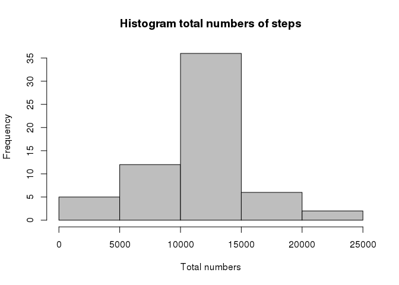

# Reproducible Research: Peer Assessment 1
jarodrigop  

## Loading and preprocessing the data

* Load required libraries. 
* If not exist the local file **activity.csv**, this is downloaded from source.


```r
library("ggplot2")

if (file.exists("activity.csv")==FALSE) {
    print ("The data files is not present. Download...")
    fileUrl<-"https://d396qusza40orc.cloudfront.net/repdata%2Fdata%2Factivity.zip"
    download.file(fileUrl, destfile="./repdata-data-activity.zip", method="curl")
    unzip("./repdata-data-activity.zip", exdir=".")
   }
```

- Load the data (i.e. read.csv())


```r
activity <- read.csv("activity.csv", header=TRUE)
```

- Transform the data.


```r
activity$date <- as.Date(activity$date, format = "%Y-%m-%d")
head(activity)
```

```
##   steps       date interval
## 1    NA 2012-10-01        0
## 2    NA 2012-10-01        5
## 3    NA 2012-10-01       10
## 4    NA 2012-10-01       15
## 5    NA 2012-10-01       20
## 6    NA 2012-10-01       25
```


## What is mean total number of steps taken per day?

- Ignoring the missing values in the dataset, the mean of steps taken per day:

```r
activity_steps_by_day <- aggregate(steps ~ date, activity, sum, na.rm=TRUE)
head(activity_steps_by_day)
```

```
##         date steps
## 1 2012-10-02   126
## 2 2012-10-03 11352
## 3 2012-10-04 12116
## 4 2012-10-05 13294
## 5 2012-10-06 15420
## 6 2012-10-07 11015
```

- The histogram of the total number of steps

```r
hist( main  = "Histogram total numbers of steps",
      x     = activity_steps_by_day$steps,
      xlab  = "Total numbers",
      col   = "gray"
     )
```

 

- Calculate and report the mean and median of the total number of steps taken per day

```r
activity_steps_by_day_mean <- mean(activity_steps_by_day$steps)
activity_steps_by_day_median <- median(activity_steps_by_day$steps)
```

* Steps teken by day:
    + mean: **10766.19**
    + median: **10765**


## What is the average daily activity pattern?

* Make a time series plot (i.e. type = "l") of the 5-minute interval (x-axis) and the average number of steps taken, averaged across all days (y-axis)


```r
activity_interval <- aggregate(steps ~ interval, activity, mean, na.rm=TRUE)
head(activity_interval)
```

```
##   interval     steps
## 1        0 1.7169811
## 2        5 0.3396226
## 3       10 0.1320755
## 4       15 0.1509434
## 5       20 0.0754717
## 6       25 2.0943396
```


```r
   plot(  x  = activity_interval$interval,
        xlab = "Interval",
        y    = activity_interval$steps,
        ylab = "Mean",
        type = "l",
        col  = "gray",
        lty  = 1
      )
```

 

* Which 5-minute interval, on average across all the days in the dataset, contains the maximum number of steps?


```r
maximun_number_steps <- max(activity_interval$steps)
maximun_number_step_pos <- activity_interval$steps==maximun_number_steps
maximum_number_step_interval <- activity_interval[maximun_number_step_pos,1]
```

* The 5-interval is **835** with an average of **206.1698113** steps.


## Imputing missing values

Note that there are a number of days/intervals where there are missing values (coded as NA). The presence of missing days may introduce bias into some calculations or summaries of the data.

* Calculate and report the total number of missing values in the dataset (i.e. the total number of rows with NAs)


```r
total_rows    <- length(activity$steps)
total_na_rows <- length(which(is.na(activity$steps)))
```

The total number of rows with NAs is **2304** of **17568**

* Devise a strategy for filling in all of the missing values in the dataset. The strategy does not need to be sophisticated. For example, you could use the mean/median for that day, or the mean for that 5-minute interval, etc.


```r
# Create new dataset 
activity_fill <- activity

# This funcion return the mean steps from a specific interval
extract_mean_from_interval <- function(n_interval) { activity_interval$steps[activity_interval$interval==n_interval] }

# Obtain the cols with steps=NA
col_na_pos <- which(is.na(activity_fill$steps))

# replate the NA cols with the mean of interval
activity_fill$steps[col_na_pos] <- sapply(activity$interval[col_na_pos], extract_mean_from_interval )
```

* Create a new dataset that is equal to the original dataset but with the missing data filled in.


```r
head(activity_fill)
```

```
##       steps       date interval
## 1 1.7169811 2012-10-01        0
## 2 0.3396226 2012-10-01        5
## 3 0.1320755 2012-10-01       10
## 4 0.1509434 2012-10-01       15
## 5 0.0754717 2012-10-01       20
## 6 2.0943396 2012-10-01       25
```


* Make a histogram of the total number of steps taken each day and Calculate and report the mean and median total number of steps taken per day. Do these values differ from the estimates from the first part of the assignment? What is the impact of imputing missing data on the estimates of the total daily number of steps?


```r
activity_fill_steps_by_day <- aggregate(steps ~ date, activity_fill, sum)
head(activity_fill_steps_by_day)
```

```
##         date    steps
## 1 2012-10-01 10766.19
## 2 2012-10-02   126.00
## 3 2012-10-03 11352.00
## 4 2012-10-04 12116.00
## 5 2012-10-05 13294.00
## 6 2012-10-06 15420.00
```

* The histogram of the total number of steps

```r
hist( main  = "Histogram total numbers of steps",
      x     = activity_fill_steps_by_day$steps,
      xlab  = "Total numbers",
      col   = "gray"
     )
```

 


## Are there differences in activity patterns between weekdays and weekends?

* For this part the weekdays() function may be of some help here. Use the dataset with the filled-in missing values for this part.

* Create a new factor variable in the dataset with two levels – “weekday” and “weekend” indicating whether a given date is a weekday or weekend day.

```r
activity_fill$day_type <- ifelse( (as.POSIXlt(activity_fill$date)$wday==0 | as.POSIXlt(activity_fill$date)$wday==6), 'weekend','weekday')
```

* Make a panel plot containing a time series plot (i.e. type = "l") of the 5-minute interval (x-axis) and the average number of steps taken, averaged across all weekday days or weekend days (y-axis).


```r
activity_mean_by_day_type <- aggregate(steps ~ interval + day_type, data=activity_fill, FUN=mean)
ggplot( data=activity_mean_by_day_type,
        aes(x=interval,y=steps) 
      ) +
      geom_line(colour="blue") +
      facet_grid(day_type ~ .) +
      labs(tittle = "Time series by type of day") +
      labs( x = "Interval") +
      labs( y = "Steps")
```

 


